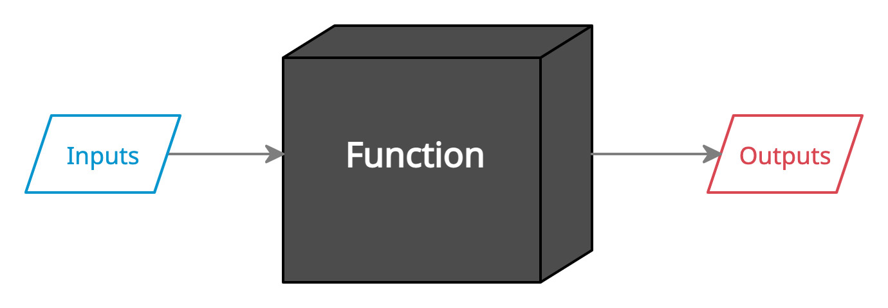
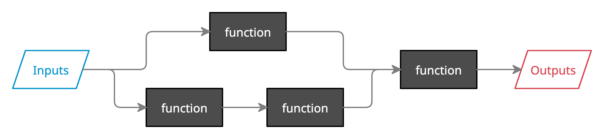
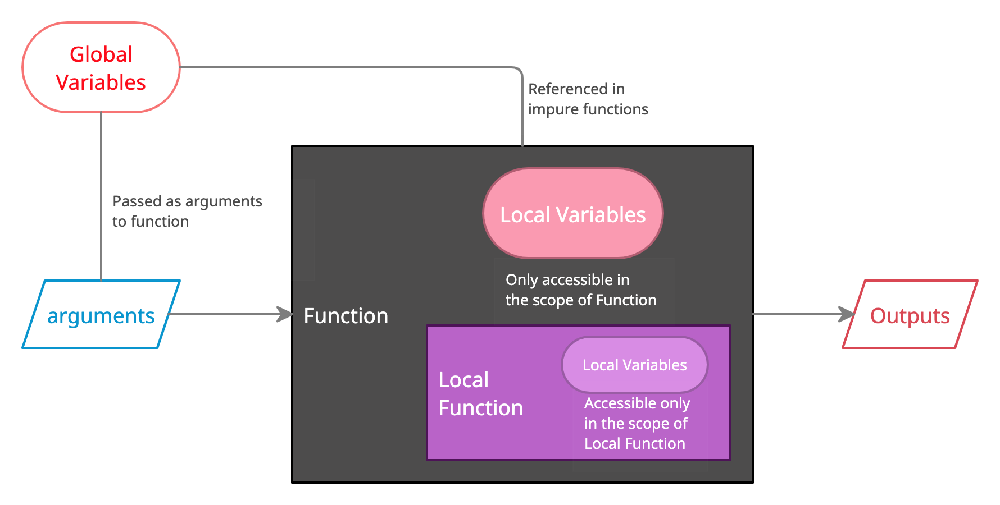
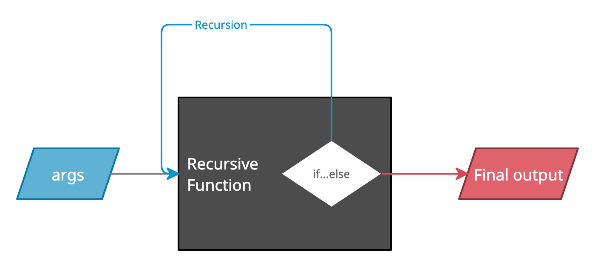

# Functions

En esa lección haremos la introdución al mundo de la programación funcional, aprendiendo conceptos sobre su elemento básico, la `función`. Algunos de esos conceptos son universales y otros son específicos de la sintáxis python.

## Que es una función?

> Una función es un bloque de codigo reutilizable. Podemos escribirle una unica vez y utilizarlo cuantas veces sea necesario. De esa manera el programa resultante que escribamos es más fácil de entender, mantener y tenemos el tiempo de trabajo optimizado.

Entretanto esa no es la principal ventaja de las funciones. Pues nosotros no utilizaremos solo las funciones que escribamos nosotros, sino que también las funciones que vienen `built-in` en python y muchas librerias que tenemos a nuestra disposición.

Eso no seria posible si a cada vez que tuvieramos que usar una función necesitaramos leer todo su codigo, interpretarle y entender cada detalle de su funcionamiento. Pero si leemos la documentación de cualquier función las informaciones que tenemos son las de los `inputs` que tenemos que pasarle y el `output` que podemos esperar, de forma que las funciones:

> Dan la capacidad de `abstracción`, nos permite tratar la función como una caja negra que recibe inputs y genera outputs, y no es necesario conocer su codigo interno para utilizarle.



Además, al trabajar con funciones, podemos tener un proceso que no sea compuesto de un unico flujo, sino que:

> Podemos segmentar el codigo en bloques menores y más manejables, permitiendo una serie de cosas como el trabajo compartido, la escalabilidad, mejor facilidad en desarollar nuevas features, etc.



Si desearamos incluir algun procesamiento más, no tendríamos que tocar el codigo que ya está hecho, sino que añadiriamos una nueva función en el flujo total del programa.

> En `python` las funciones tienen el tipo `function`. Además de llamarle con argumentos, podemos asignar una función a una variable y incluso pasar una función como argumento a otra (desde que esa sea compatible con un argumento del tipo función), en lo que se llama patrón `Callback`

## La firma de la función

La linea de codigo que inicia la definición de una función se llama la `firma` (`signature`) de esa función y es caracterizada pela palabra especial `def`.

```python
def function():
    pass
```

Seguido a la palabra `def` ponemos el nombre que queremos dar a esa función y paréntesis. Dentro de esos paréntesis definiremos los parámetros de la función. 

> Las funciones pueden o no tener parámetros. Pero la llamada siempre tiene que ser compatible con su definición. Eso es, el numero de argumentos que le pasamos a la función en su llamada tiene que ser exactamente el numero de parámetros con el cual la función fué definida.

### Parameters vs Arguments

Se llaman parámetros a las variables del scope local de una función, definidos en la firma de esa función. Por otro lado, los argumentos son los valores que se pasan a esa función al llamarla. 

Una función puede tener parámetros opcionales desde que se les asigne un valor por defecto. Eso significa que en el caso de una llamada a esa función sin un argumento para ese parámetro, él tendrá el valor definido como por defecto. Sintáticamente utilizamos el signo de `=` en la firma para indicar el valor por defecto.

```python
def function(a,b=[],c=None):
    pass
```

Como los argumentos, los valores por defecto pueden ser de cualquier tipo.

>La palabra `pass` en python no se limita a las funciones, pero se usa en los locales donde deberia haber un bloque de código para evitar un error del tipo `SyntaxError`. Por ejemplo, si queremos dejar explicito que habrá una función con determinado nombre, pero todavía no hemos escrito esa función.

## Return

Para indicar el termino de una función y el valor que la ejecución debe devolver utilizamos una otra palabra especial, el `return`.

```python
def is_greater(a,b):
    return a > b
```

> Siempre que la ejecución del código encuentre la palabra `return` la ejecución de la función terminará y devolverá un valor. Ningún codigo dentro del bloque de la función después del return no será ejecutado.

> Se puede utilizar más de una vez el return en una misma función, pero solo uno se ejecutará. Eso es util para funciones que deben devolver diferentes cosas dependiendo del caso que encontre.

```python
def largest(a,b):
    if a > b:
        return a
    else:
        return b
```

Igual a que se puede utilizar más de una vez la palabra return, también se puede omitir esa. Pero hay que saber que `¡todas las funciones devuelven algo!`, independiente de tener `return o no`.

Las funciones que no poseen return devolveran un objeto del tipo `None`, que es un tipo de objeto específico en python.

Por lo tantom una función, en python, siempre devuelve algo y devuelve solamente un `único` objeto. Y ese objeto puede ser de cualquier tipo. Si separamos dos valores en el return por una coma el return será del tipo `tuple` con los diferentes valores.

```python
def sum_mult(a,b):
    return a + b, a * b
```

## Colecciones de funciones

Como parte importante del uso de las funciones es su reutilizabilidad, necesitamos una manera de poder estruturarles y guardarles. Esas estruturas de ficheros de las cuales cargamos funciones se llaman módulos o librerias.

Podemos crear nuestros proprios modulos guardando codigo en diferentes ficheros o utilizar aquelos que descargamos con `pip`. 

Siempre que queremos traer algun objeto o función de un módulo o libreria utilizamos la palabra `import`.

```python
import pandas as pd
import numpy as np
import matplotlib
from helper import GoogleRequest
```

Hay diferentes maneras de realizar el `import`, como en el ejemplo arriba. Utilizando el `as` definimos un alias para lo que estamos importando.

Y utilizando el `from <module> import <function>` podemos no importar toda una libreria, sino que solo la parte que necesitemos.

## Methods

Los diferentes tipos (clases) tienen sus funciones particulares a las cuales se llaman `metodos`. Son funciones como las demás, pero que pertenecen a un tipo específico.

> Los metodos se llaman utilizando el punto y su nombre.

```python
str.title()
list.append(x)
```
Donde `str` y `list` son objetos de esas clases. No podriamos hacer `list.title()` pues ese metodo no existe para ese tipo.

> * Una función no es un método
> * Un método sí es una función

## Tipos de funciones

Las funciones se clasifican segun dos categorias.

La primera división se hace entre:

>### Funciones puras
> Se consideran funciones puras aquellas cuyo output (valor que devuelve) depende `solo` de sus inputs (parámetros de entrada), sin depender del contexto en que se define y llama la función.

>### Funciones impuras 
> Son funciones impuras aquellas que si dependen de un `contexto`, eso es, no dependen solo de sus parámetros de entrada. Eso significa que esas funciones dependen de valores que están definidos en el `scope global`.

La segunda división marca la separación entre:

> ### Funciones deterministas
> Que son las funciones que siempre que llamadas con los mismos argumentos devuelven el mismo output. Eso significa que el comportamiento de la función es previsible.

> ### Funciones no deterministas
> Por otro lado, si el resultado de una función varía aunque se la llame con los mismos argumentos, a esa función se clasificará como `no determinista`. Por ejemplo, las funciones del tipo `random` son funciones no deterministas.

Los dos tipos de clasificacion no se excluyen. Eso es, las funciones pueden ser:
- Puras deterministas
- Puras no deterministas
- Impuras deterministas
- Impuras no deterministas

## Scope
- Se llama `scope global` el conjunto de objetos (variables, funciones, etc.) a los cuales se puede referir en cualquier parte de un programa. Pertenecen al `namespace` global.
- El `scope local` se compone de los objetos a los cuales solo se puede acceder desde un `namespace` particular, e.g.: dentro de la definición de una función o clase, etc.

Si definimos una función dentro de otra función, la función interior solo se podrá utilizar dentro de la función exterior (excepto en el caso de que la función interior sea el return de la otra). 

Igualmente, la función interior tiene su proprio scope y así succesiva y eternamente.



## Recursivity

Si una función hace una llamada a si mismo dentro de su definición, se dice que esa función es recursiva. La recursividad es una heramienta utilizada en el caso de que una función necesite repetir multiples veces un mismo proceso.

Pero la función recursiva, cuando llama a si misma, tiene que hacerlo con diferentes argumentos, para que su resultado sea diferente. Caso contrário, se estará creando un bucle infinito y recibiriamos un error de máxima recursividad.

```python
def countdown(n):
    if n > 0:
        print(f"{n}...")
        countdown(n-1)
    else:
        print("Liftoff!!!")
```

Ejemplo de la representación una función recursiva:



## Anonymous functions

Hay un tipo de función especial que se llaman `funciones anónimas` o funciones `lambda` que así se llaman por la palabra usada para definirles. Las funciones lambda poséen una característica particular que es no tener nombre, por eso anónimas.

```python
lambda a,b: a/b
```

Las funciones lambda no se definen con def, no tienen nombre ni se puede usar return en ellas. Es una manera corta de escribir funciones rápidas y poco permanentes. Eso es, son una espécie más "desechable" de función.

El principal uso de las funciones lambda es en el patrón `callback` previamente mencionado, donde se utiliza una función como argumento de otra. En ese caso, la función lambda será argumento para la otra función.

```python
def apply(arr, fn):
    res = []
    for e in arr:
        res.append(fn(e))
    return res

apply([1,2,3,4,5,6], lambda x: x**2)
```