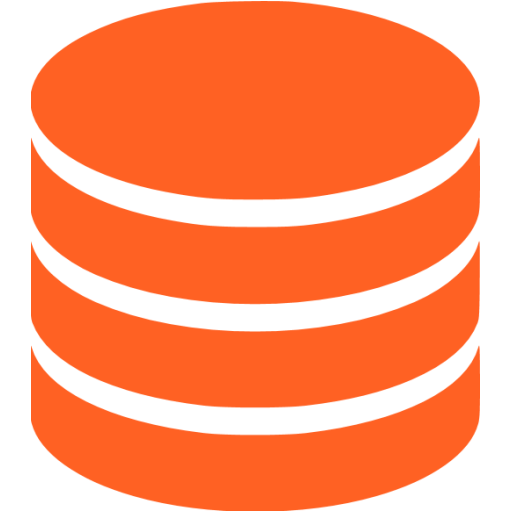
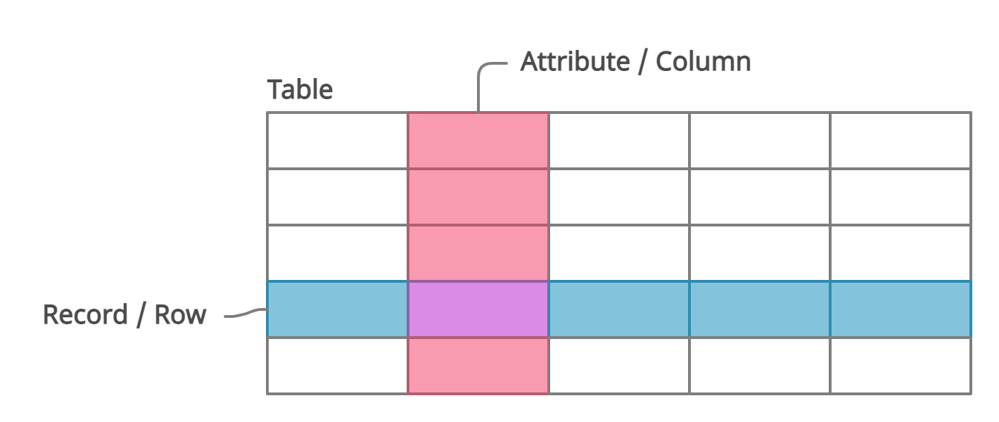
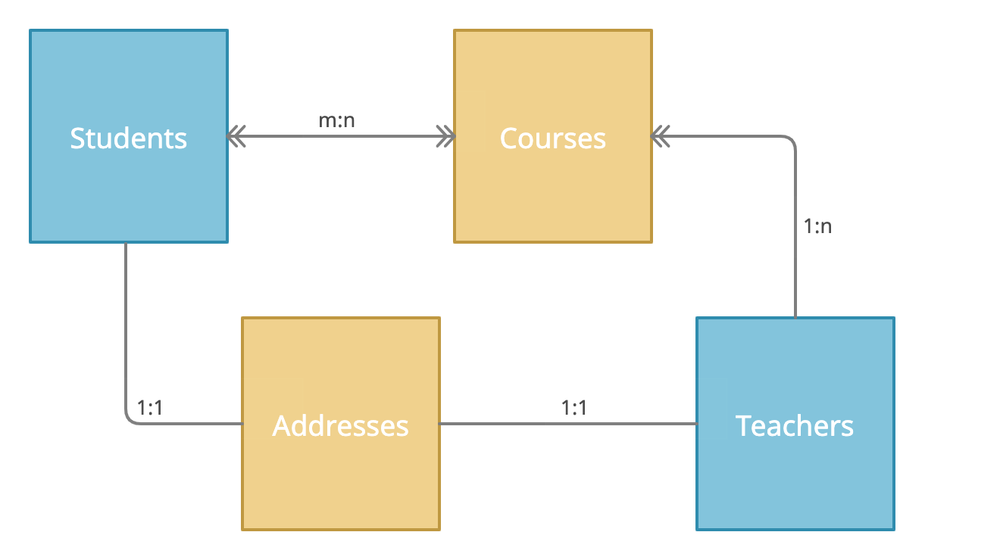
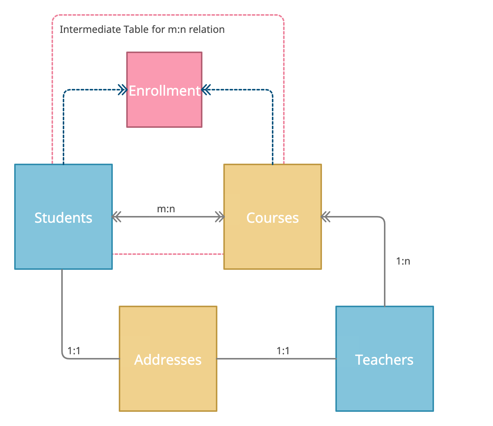

# SQL

## What is a database?

Una base de datos es un conjunto de información organizada sistemáticamente de manera a permitir el fácil aceso y la permanéncia de esos datos. Hay 4 operaciones básicas que asociamos con las bbdd, bajo el acrónimo [CRUD](https://en.wikipedia.org/wiki/Create,_read,_update_and_delete).

## Did you know?

>Seguramente ya has visto un icono como el de la izquierda, ese es el símbolo informático de base de datos, representado por cilindros empillados. ¿Pero sabes por qué ese símbolo vino a representar las bbdd? 
>
>Por los dispositivos físicos de mémoria de los ordenadores antiguos, sobretodo el disco duro del IBM 305 RAMAC (del año 1956), como el de la foto arriba. Esa coleción de discos tenía capacidad para almacenar 4MB de información.

### CRUD

Las 4 letras del acrónimo se refieren a las 4 formas basicas que tenemos de interactuar con una base de datos:

- Create (Crear)
- Read (Leer)
- Update (Actualizar)
- Delete (Borrar)

Con esos 4 tipos de operaciones, podemos almacenar y consultar datos según nuestra necesidad, manteniendo los datos seguros y ordenados. Pero para que eso sea posible, necesitamos que la organización de los datos y las operaciones sigan un sistema determinado.

## Relational Database

Más especificamente, en esa lección estaremos estudiando un tipo específico de bases de dato: las `bases de datos relacionales`. Ese tipo de base de datos sigue un modelo llamado [modelo relacional](https://en.wikipedia.org/wiki/Relational_model) creado por el informático [Edgar Frank Codd](https://en.wikipedia.org/wiki/Edgar_F._Codd) a partir del año 1969 cuando él trabajaba en IBM. Desde entonces, ese tipo de base de datos se convertió en un marco y un standard de almacenamiento de datos en la computación.

## DBMS

Para que los conceptos de las bases de datos relacionales se conviertan en realidad útil, dependemos de un programa, el motor de nuestra base de datos, el Database Managment System, el `sistema de gestión de base de datos`. 

Ese programa es el responsable por el almacenamiento de la información, asegurarse de que siguén los preceptos de la bbdd y interactuar con humanos y otros programas para que se puedan ejecutar las operaciones `CRUD`.

Hay muchos tipos diferentes de esos sistemas, unos para bases de datos relacionales (popularmente llamadas SQL) y otros no (noSQL). 

Dentre los motores de bases de datos relacionales, podemos citar:

- PostgreSQL
- Oracle
- MySQL
- Microsoft SQL Server
- SQLite
- MariaDB
- Airtable
- Amazon Aurora
- SQLite

Todos esos comparten no solo el hecho de que son bases de datos relacionales, pero también utilizan un mismo lenguaje de programación llamado `SQL`.

## SQL

`SQL`, o `Structured Query Language`, es un lenguaje de programación de uso específico, interactuar con bases de datos relacionales.

Diferentemente de otras lenguajes de programación, como `Python`, donde describimos como queremos que se ejecuten una serie de acciones, en `SQL` nos saltaremos esa descripción. Simplemente diremos que queremos y el proprio DBMS es responsable por saber que se debe hacer para que recibamos el resultado esperado.

Como hay diferentes DBMS que usan SQL, hay diferentes `flavours` o `dialectos` de SQL. Todos ellos comparten de la misma estructura y base, pero cada cual tiene sus particualridades. En ese curso, usaremos `PostgreSQL`.

## GUI

Hay muchas maneras de interactuar con el DBMS, por la terminal, usando otro lenguaje de programación como parte de algun programa, o con una interfaz dedicada para eso. La interfaz que usaremos para gestionar nuestras bases de datos Postgres será `pgAdmin`.

## Tables

En las bases de datos SQL, los datos se organizan en tablas. Las tablas son matrices de 2 dimensiones donde se guardan información de un mismo tipo. Eso es, en una tabla, todos los registros se refieren a un mismo tipo de datos (usuarios, pagos, películas, etc.)

Las filas (o `registros`) son las diferentes entidades, todas pertenecentes a un mismo tipo. 

Por otro lado, las columnas (o `atributos`) guardan alguna característica de los registros. Las columnas de una tabla se definen en el momento de creación de la tabla y sus valores deben ser del mismo tipo (integer, float, string, etc.) en todas las filas.

Cada tabla debe contener una columna que contenga un identificador único de los registros, que no se repita y no sea nulo. Esa columna se llama `Primary Key` (clave primaria).

## Entity Relations

La otra característica esencial de las bbdd SQL es que pueden haber relaciones entre las diferentes tablas. Esas relaciones son lo que permiten que emparejemos filas de tablas diferentes según alguna lógica, lo que se llama una operación `JOIN`.

Las relaciones pueden ser de uno de los diferentes tipos:

> 1:1
>  
> Ese tipo de relación es cuando un elemento de cada tabla solo se puede relacionar con un elemento de la otra. Ese tipo de relación es como si hubieramos dividido la información de una misma tabla en dos.

> 1:n
>  
> Cuando un elemento de la tabla A puede estar referenciado en, y por lo tanto relacionado con,  muchos elementos de la tabla B, decimos que esa relación es del tipo `1:n`.

> m:n
>  
> Ultimamente, un elemento de cada tabla puede estar relacionado con más de un elemento de la otra tabla, en una relación del tipo `m:n`. En la practica, ese tipo de relación solo se forma con una tabla intermédia, con la cual ambas A y B tienen una relación del tipo 1:n.

## Further Materials

- [Sally Sequel](https://www.youtube.com/watch?v=27axs9dO7AE), the lego SQL DBMS. ;)
- [World Database](https://www.postgresql.org/ftp/projects/pgFoundry/dbsamples/world/world-1.0/)
- [Pagila (Postgres Sakila)](https://github.com/devrimgunduz/pagila)