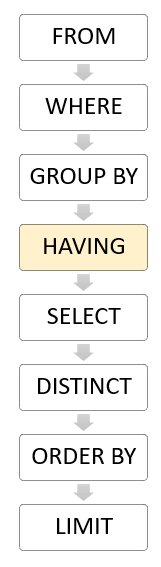

# Advanced SQL Queries

## HAVING 
Una otra cláusula muy útil es la cláusual `HAVING`, usada para filtrar la tabla resultante de un SELECT, no muy diferente de la ya vista `WHERE`, pero con una diferencia elementar. En el caso de `HAVING`, esa cláusula es evaluada (procesada) después del `GROUP BY`, mientras `WHERE` se evalua antes de esa.



_Order of clause evaluation_

Utilizando la base de datos `world`, verifique la diferencia entre las dos siguientes queries:

```postgres
SELECT countrycode, AVG(population)
FROM city
WHERE population > 1000000
GROUP BY countrycode;
```

```postgres
SELECT countrycode, AVG(population)
FROM city
GROUP BY countrycode
HAVING AVG(population) > 1000000;
```

## CASE

Una otra manera de utilizar los condicionales en postgreSQL es con la expresión `CASE`, que tiene una función parecida al `if...else` en otros lenguajes de programación y análogo a los ternários.

Aunque se pueda utilizar en cualquier posición sintática en que se puedan usar expresiones, su principal uso es en el SELECT.

Se utiliza toda la expresión case como una columna

```postgres
SELECT "name", population,
	CASE
		WHEN population > 10000000 THEN 'enormous'
		WHEN population >  1000000 THEN 'large'
		WHEN population >   500000 THEN 'medium'
		WHEN population >    50000 THEN 'small'
		ELSE 'minuscule'
	END AS "size"
FROM city;
```

## Sub-queries 

Una subquery es una query anidada dentro de una query maior. Una subquery puede estar dentro de un SELECT, INSERT, UPDATE o DELETE, dentre otros, pero la cláusula donde más comunmente se usa es en el `WHERE`.

La subquery es una query del tipo select que se encapsula en paréntesis. Luego esa query la usamos en los sitios donde sintáticamente usariamos una tabla. Veamos.

Si quisieramos filtrar las ciudades por la media de las poblaciones, la podríamos calcular con lo siguiente.

```postgres
SELECT AVG(population)
FROM city;
```

Del cual recebemos el valor `350668.295833333333`.

La query abajo, aunque funcional es muy limitada y `hard-coded`. Si cambian los datos, pasa a funcionar diferente.

```postgres
SELECT "name", population
FROM city
WHERE population > 350668.295833333333;
```

Siguiendo las buenas practicas, podemos comparar no con ese valor fixo, sino que con la propria query de donde lo hemos obtenido anteriormente, así:

```postgres
SELECT "name", population
FROM city
WHERE population > (SELECT AVG(population)
					FROM city);
```


## CREATE TABLE AS

Podemos utilizar una expresión en nuestra query para que el resultado no se nos enseñe, pero que se guarde en una tabla, podiendo esa ser una tabla permanente o temporal.

Para eso solo tenemos que preceder el select con la expresión `CREATE TABLE <name> AS`.

```postgres
CREATE TABLE city_size AS
SELECT "name", population,
	CASE
		WHEN population > 10000000 THEN 'enormous'
		WHEN population >  1000000 THEN 'large'
		WHEN population >   500000 THEN 'medium'
		WHEN population >    50000 THEN 'small'
		ELSE 'minuscule'
	END AS "size"
FROM city;
```
A partir del momento que esa query se ejecutara con éxito, ya estaría disponible la tabla city_size para cualquier consulta o operación como una tabla cualquiera.

Por otro lado, si no tenemos la necesitad de guardar permanentemente esa tabla, podemos declarar en su definición que esa tabla es temporal. De esa manera, la tabla estará disponíble mientras esté abierta la sesión, dejando de existir cuando esta se cierre.

Para hacerlo simplesmente indicamos que la tabla será temporal. Para

```postgres
CREATE TEMPORARY TABLE city_size AS
...
```
