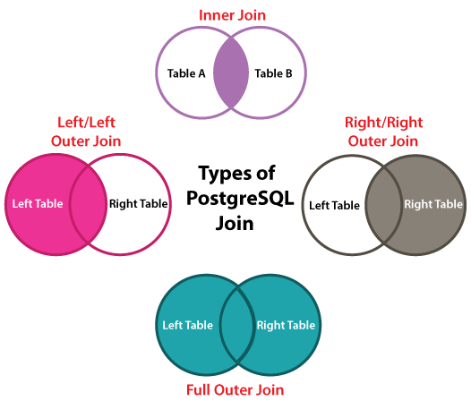

# Join Clause

El JOIN es una operación muy usada en las bases de datos relacionales, pues es la operación que nos permite sacar provecho de las relaciones entre las tablas.

Esa operación es responsable por unir las filas de dos tablas (`A` y `B`, o `Left` y `Right`). Pero esa union no es una simple concatenación, sino que es una union que se realiza segun algun parámetro que definamos.

```postgres
Left_Table JOIN Right_Table
ON Left_Table.value = Right_Table.value 
```

La operación join devuelve una tabla y la ponemos donde pondríamos una tabla en la query select. Igualmente ponemos hacer un JOIN entre la tabla resultante de un join y una otra tabla, haciendo union entre multiples tablas.

La cláusula ON va a definir los parámetros segun el cual las filas de las diferentes tablas se van unir. Aunque el más normal sea unir porque hay una relación de Foreign Key, otras condiciones pueden ser usadas. Siempre que el condicional genere un valor True, las dos filas serán unidas en la tabla resultante. 

Si dos tablas son unidas con una condición que siempre sea True, todas las filas de la tabla Left se emparejaran con todas las filas de la tabla Right.

## Types of Join


Los diferentes tipos de join son importantes para que sepamos cuales será la estratégia para con los nulos. 

> Las tablas a seguir seran las tablas utilizadas en los diferentes ejemplos de JOIN.

<div style="width: 50%; float:left">
<h3>Left Table</h3>

|id|name|
|--|--|
|1|Pepe|
|2|Marina|
|3|Sarah|
</div>

<div style="width: 50%; float:right">
<h3>Right Table</h3>

|id|profession|
|--|--|
|2|lawyer|
|3|teacher|
|4|scuba diver|
</div>

### Left and Right Join

Si hacemos un Left o Right join, estaremos favoreciendo una de estas tablas. En ese caso todos los elementos de la tabla eligida estarán en la tabla resultante. Aquellos que no posean equivalente en la otra table tendrán esos valores sustituidos por nulos.

Por ejemplo, si hicieramos:

```postgres
SELECT * FROM
Left_Table LEFT JOIN Right_Table
ON Left_Table.id = Right_Table.id
```

La tabla resultante tendría todas las filas de Left, pero en aquellos casos que no hay una fila de Right que cumpla la condición, el valor para Right_Table.id será NULL.

|Left_Table.id|name|Right_Table.id|profession|
|--|--|--|--|
|1|Pepe|NULL|NULL
|2|Marina|2|lawyer
|3|Sarah|3|teacher

El Right Join nos daria otro resultado.

```postgres
SELECT * FROM
Left_Table RIGHT JOIN Right_Table
ON Left_Table.id = Right_Table.id
```

|Left_Table.id|name|Right_Table.id|profession|
|--|--|--|--|
|2|Marina|2|lawyer
|3|Sarah|3|teacher
|NULL|NULL|4|scuba diver

## Full Outer Join

El Full Outer Join es la unión entre ambos Left y Right Join. Todas las filas de ambas las tablas estarán presentes en el resultado, y en todos los casos en que la condición no se haya cumplido, habrá un nulo.

```postgres
SELECT Left_Table.id, Right_Table.id FROM
Left_Table FULL OUTER JOIN Right_Table
ON Left_Table.id = Right_Table.id
```

|Left_Table.id|name|Right_Table.id|profession|
|--|--|--|--|
|1|Pepe|NULL|NULL
|2|Marina|2|lawyer
|3|Sarah|3|teacher
|NULL|NULL|4|scuba diver

## Inner join

Al contrario de lo posible con los tipos anteriores, en el Inner Join no habrán nulos, pues solo se consideraran las filas en que la condición establecida se cumpla. Ese es el tipo de join `default` en Postgres.

```postgres
SELECT Left_Table.id, Right_Table.id FROM
Left_Table JOIN Right_Table
ON Left_Table.id = Right_Table.id
```

|Left_Table.id|name|Right_Table.id|profession|
|--|--|--|--|
|2|Marina|2|lawyer
|3|Sarah|3|teacher

## Using Aliases

Cuando queremos hacer operaciones JOIN, sobre todo si son muchas, el proceso puede tornarse muy verboso, pues necesitamos especificar el origen de las columnas que tengan el mismo nombre. En ese caso es muy util el uso de los aliases para poder facilitar el proceso. Simplemente indicamos con `AS <alias>` el nombre que queremos dar provisoriamente a esa tabla. Por ejemplo:

```postgres
SELECT u.name, p.name AS product, up.contract_number 
    FROM
        users AS u 
        JOIN
        user_has_product AS up 
            ON u.id = up.user_id
        JOIN
        products AS p 
            ON p.id = up.product_id
;
```