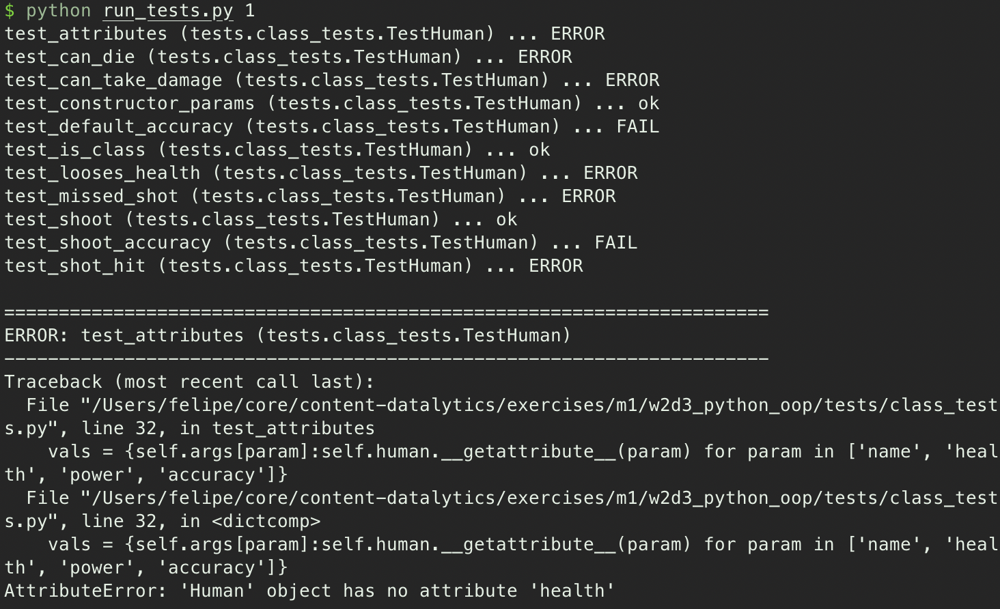

# Humans vs. Aliens


## Objectives
En ese ejercicio, vamos practicar los conceptos de OOP en Python:

- definición de clases
- atributos y métodos
- herencia de clases
- inyección de dependencias

## Instructions
Para eso vamos definir clases para los personajes de un videojuego en el cual hay una invasión extraterrestre en la Tierra.

Trabajaréis exclusivamente en `characters.py`, donde debéis definir las siguientes clases según las instrucciones. Los demás ficheros contenidos en ese repositorio son los ficheros responsables por el `unittesting`, las pruebas automáticas que verificaran si cada una de las clases cumple con los parámetros definidos.

> `Atención:` Como los tests están automatizados, es importante que las clases, métodos y atributos tengan el mismo nombre que los en la descripción. Otras variables locales pueden tener cualquier nombre.

## Ejecutando los tests

Una vez que tengas definida alguna de las clases, es el momento de probar como se porta esa clase frente a los test. Para eso, ejecutaremos el script `run_tests`. 

En la carpeta correspondiente, con el siguiente comando:

```shell
python run_tests.py <TEST_NUMBER>
```

Donde debemos sustituir `<TEST_NUMBER>` por el numero de la clase que queremos testear según la tabla.

|test_number| class |
|--|--|
|1|Human|
|2|Sniper|
|3|Alien|
|4|Squad|
|5|Battle|

Se pueden combinar más de un test a la vez, eso es:

El comando `python run_tests.py 13` ejecutaría los tests correspondientes a las clases `Human` y `Alien`. Si usáramos el argumento `12345`, todos los test se ejecutan.

> ¡Son muchos tests! Cosa que puede complicar la lectura. Lo mejor es seguir poco a poco y no avanzar a la clase siguiente sin haber pasado todos los tests de la clase actual.



Lo primero de todo en el resultado del test, será una secuencia con el nombre de cada test y uno de los 3 posibles resultados:

- `ok` : el resultado esperado, que hemos aprobado ese test
- `FAIL` : un fallo significa que nuestro método, atributo o lo que estemos testeando tuvo un resultado diferente del esperado.
- `ERROR` : significa que hubo un error en la ejecución del código y no se produjo un resultado para comparar con el esperado.  

Después de ese listado de resultados, vemos detalladamente cada error o fallo. Debemos leer con atención la información proporcionada por el test. Por ejemplo, en la imagen  anterior, el error nos dice que `'Human' object has no attribute 'health'`. Eso significa que nos hemos olvidado de implementar ese atributo, hemos escrito mal su nombre, etc.

`TDD`, o [Test Driven Development](https://en.wikipedia.org/wiki/Test-driven_development) es una de las posibles maneras de organizar y direccionar un proceso de desarrollo de software.

# Clases
## Human
> ### Atributos:
> - name
> - health
> - power
> - accuracy

El atributo `accuracy` debe tener un parámetro por defecto de 50, salvo en el caso de que se le pase otro valor

> ### Métodos:
> - human.shoot()
>
> Utilizando [np.random.randint](https://numpy.org/doc/stable/reference/random/generated/numpy.random.randint.html), se genera un numero aleatorio de 1 a 100, ambos inclusive. Si ese número es menor o igual al atributo `accuracy` del personaje, el método devuelve su atributo `power`, caso contrario, se devuelve el valor `0`.
>
> - human.takeDamage(damage)
>
> Ese método resta el daño de un disparo del atributo `health` del personaje afectado. Hay 3 posibles valores en la devolución de esa función:
>
>>- `"Shot missed."` en caso de que `damage` sea `0`.
>>- `"Elson Must lost 3 health"`, en el caso de un personaje llamado `Elson Must` que reciba `damage` de valor `3`. (Debes sustituir el nombre del personaje y el valor de damage)
>>- `"Elson Must died."` si el disparo resultó en fatalidad (no hay más puntos en `health`). (Debes sustituir el nombre del personaje)

## Sniper
> ### Atributos:
> - name
> - health
> - power
> - accuracy

El atributo `accuracy` debe tener un parámetro por defecto de 50, salvo en el caso de que se le pase otro valor

Por sus habilidades especializadas, el `accuracy` de un `Sniper` tiene un bonus de 15 sobre el valor pasado en su construcción.

> ### Métodos:
> - sniper.shoot()
>
> Utilizando [np.random.randint](https://numpy.org/doc/stable/reference/random/generated/numpy.random.randint.html), se genera un número aleatorio de 1 a 100, ambos inclusive. Si ese número es menor o igual al atributo `accuracy` del personaje, el método devuelve su atributo `power`, caso contrario, se devuelve el valor `0`.
>
>Los Sniper tienen reflejos muy rápidos y en el caso de que fallen el primer disparo (el valor aleatorio supera su `accuracy`), reciben una segunda oportunidad.
>
> - sniper.takeDamage(damage)
>
> Ese método resta el daño de un disparo del atributo `health` del personaje. Hay 3 posibles valores en la devolución de esa función:
>>- `"Shot missed."` en caso de que `damage` sea `0`.
>>- `"Elson Must lost 3 health"`, en el caso de un personaje llamado `Elson Must` que reciba `damage` de valor `3`. (Debes sustituir el nombre del personaje y el valor de damage)
>>- `"Elson Must died."` si el disparo resultó en fatalidad (no hay más puntos en `health`). (Debes sustituir el nombre del personaje)

## Alien
> ### Atributos:
> - health
> - power
> - accuracy

El atributo `accuracy` de los Alien debe tener un parámetro por defecto de 65, salvo en el caso de que se le pase otro valor

> ### Métodos:
> - alien.shoot()
>
> Utilizando [np.random.randint](https://numpy.org/doc/stable/reference/random/generated/numpy.random.randint.html), se genera un número aleatorio de 1 a 100, ambos inclusive. Si ese número es menor o igual al atributo `accuracy` del personaje, el método devuelve su atributo `power`, caso contrario, se devuelve el valor `0`.
>
>
> - alien.takeDamage(damage)
>
> Ese método resta el daño de un disparo del atributo `health` del personaje. Hay 3 posibles valores en la devolución de esa función:
>>- `"Shot missed."` en caso de que `damage` sea `0`.
>>- `"Alien lost 3 health"`, como los Alien no tienen nombre, caso uno reciba `damage` de valor `3`.
>>- `"Alien scum destroyed."` si el disparo resultó en fatalidad (no hay más puntos en `health`)

## Squad
> ### Atributos:
> - fighters

La clase `Squad` posé dependencias, pues los elementos contenidos en su atributo son objetos de cualquiera de las 3 clases anteriores.

En su construcción, la clase `Squad` debe ser capaz de recibir cualquier número de `fighters`, de `0` a `n`.

> ### Métodos:
> - squad.add(fighter)
>
>El método add debe ser capaz de recibir un objeto de las clases `Human`, `Sniper` o `Alien` y añadirle al final del atributo `fighters`, uniendo un nuevo combatiente.
>
> - squad.remove(fighter):
>
> Igualmente, el método `remove` debe ser capaz de eliminar el objeto que se le pase del atributo `fighters`.
>
> - squad.\_\_len\_\_():
>
> Implementad el método `__len__`, que debe devolver la cantidad de combatientes en el atributo `fighters`.
>
> - squad.\_\_iter\_\_():
>
> El método `__iter__` también debe ser implementado y debe devolver `iter(self.fighters)`.

Esos dos últimos métodos no serán llamados explícitamente, pero nos permitirán verificar la cantidad de combatientes por medio de `len(squad)` y que iteremos por esos luchadores con `for fig in squad`.

## Battle
> ### Atributos:
> - aliens
> - humans

La clase `Battle` debe recibir un `Squad` de aliens y uno de humanos en su construcción.

> ### Métodos:
> - battle.attack(attackingArmy, defendingArmy)
>
>El método attack recibe dos parámetros, el ejército que ataca y el que defiende. Esos parámetros serán los proprios atributos de esa clase `battle.aliens` y `battles.humans`.
>
>Cada uno de los combatientes del `attackingArmy` atacará en secuencia. Y cada uno atacará uno de los miembros del ejército adversario elegido aleatoriamente.
>
>Los soldados que se mueran deben ser retirados de sus respectivos `Squad`. 
>
>Esa función debe devolver un diccionario con la siguiente forma:
```
{
    "shots_missed":0,
    "shots_hit":0,
    "enemies_killed":0
}
```
> Demostrando el resultado de ese turno. `shots_hit` y `enemies_killed` deben ser valores excluyentes. Eso es, si un adversario muere, solo cuenta para `enemies_killed` y no para `shots_hit`.
>
> - battle.status()
>
>Hay tres posibles resultados para esa función. Si todavía hay elementos en ambos `Squad`:
>
> - `"The battle goes on. Our planet depends on it."`
>
> Caso contrario, una de las siguientes respuestas, dependiendo del ejercito ganador:
>
> - `"Humans saved the Earth. The planet is still ours, for now."`
>
> - `"The human race failed. Aliens conquered the Earth."`